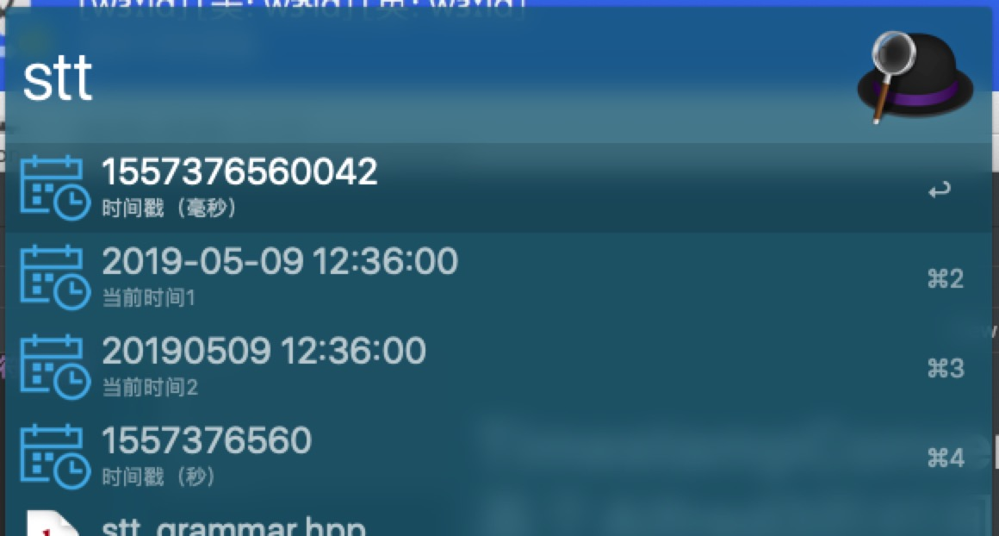
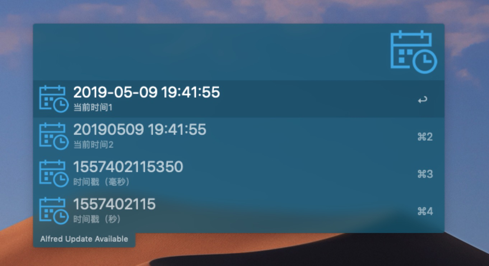
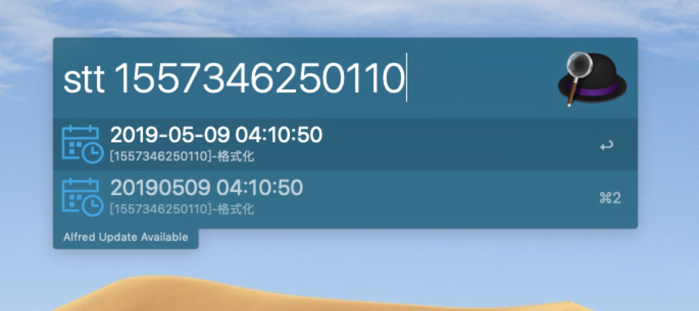
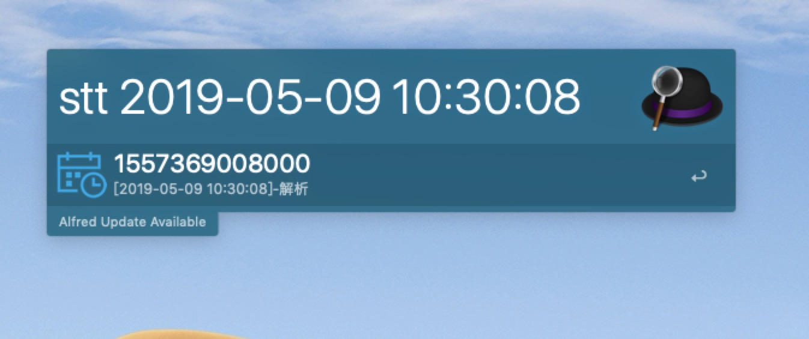

原作者地址：https://github.com/RysisLiang/TimestampConversion

# TimestampConversion | 基于Alfred3的时间戳与时间字符串转换

## 简介

直接下载 `Timestamp Tools.alfredworkflow` 文件双击即可使用

或者有其它需求可以下载Python的源码，修改后再在新建的workflow所在的文件夹下面粘贴即可。

---

## 更新日志

- 修改为python3支持

---

## 使用介绍

### 1. 默认情况

先打开搜索框后，输入 `stt` ，即可看到当前时间的字符串形式和时间戳（毫秒和秒），在选项上回车即可复制结果

快捷键方式。可以使用 `option` + `t` 的方式直接打开转换的输入框。
如果当前有选中的文本，直接使用快捷键 `option` + `t` 会直接返回处理的结果。

ps: [2019-05-09]~~正常情况是可以获取到当前选中的内容，然后通过快捷键直接复制上的。但是不知道为什么本地测试不行？~~
    是我电脑的alfred权限设置的问题。。。/笑哭
    
### 2. 时间戳转时间

输入 `stt` + `时间戳（秒和毫秒均可识别）` ，即会默认转换成 `yyyy-MM-dd HH:mm:ss` 和 `yyyyMMdd HH:mm:ss` 两种时间格式的字符串

### 3. 时间转时间戳

输入 `stt` + `时间字符串（指定格式）` ，即会默认转换成毫秒时间戳形式

`yyyy-MM-dd HH:mm:ss` 格式的例子

可识别的格式列表

- `yyyyMMdd HH:mm:ss`
- `yyyy-MM-dd %H:mm:ss`
- `yyyyMMdd %H:mm:ss`
- `yyyy/MM/dd %H:mm:ss`
- `yyyy.MM.dd %H:mm:`
- `yyyy-MM-dd`
- `yyyyMMdd`
- `yyyy/MM/dd`
- `yyyy.MM.dd`
 
---

## 使用的库和参考

1. alfred.py - https://github.com/nikipore/alfred-python

## License

MIT ©
